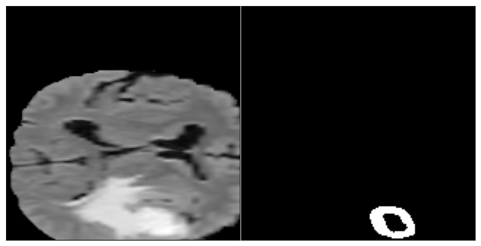
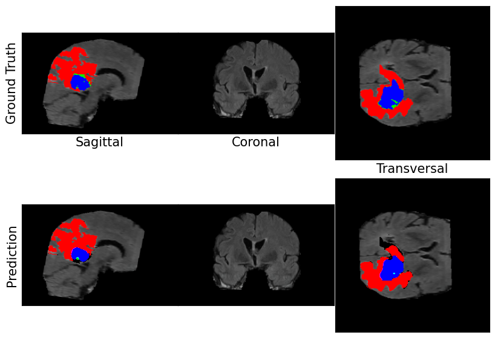

# 3D-Brain-Tumor-Segmentation-UNet
Implementation of a 3D U-Net for brain tumor segmentation on MRI data using patch-based inference, with evaluation using Dice coefficient, sensitivity, and specificity.

This project implements a deep learning-based approach for **3D brain tumor segmentation** using a pre-trained U-Net model on MRI data. The pipeline includes data preprocessing, patch-based inference, and performance evaluation.

---
##  Model Details

This project uses a **pre-trained 3D U-Net model** for brain tumor segmentation.

Due to the high computational cost and memory requirements of training 3D models on volumetric MRI data, the focus of this project is on:

- Patch-based inference on 3D MRI volumes  
- Data preprocessing and normalization  
- Performance evaluation using medical imaging metrics  

The pretrained model enables efficient experimentation and evaluation without requiring extensive GPU resources.

##  Project Overview

- Task: Multi-class brain tumor segmentation
- Model: 3D U-Net
- Data: MRI scans (BraTS dataset)
- Approach: Patch-based inference
- Evaluation Metrics: Dice Coefficient, Sensitivity, Specificity

---
##  Features

- 3D medical image segmentation using deep learning
- Patch-based processing for large volumetric data
- Standardization of MRI inputs
- Multi-class tumor segmentation (edema, enhancing tumor, etc.)
- Performance evaluation with clinically relevant metrics

---

##  Project Structure

3D-Brain-Tumor-Segmentation-UNet/

│
── src/

 │ ── segmentation_pipeline.py

 │ ── util.py


── README.md

── requirements.txt

── .gitignore


---

##  Dataset

This project uses the **BraTS (Brain Tumor Segmentation) dataset**.

Download it from:
https://www.med.upenn.edu/cbica/brats2020/data.html

After downloading, organize the dataset as follows:

data/

  ── BraTS-Data/
  
  ── imagesTr/
  
  ── labelsTr/


---

## Pretrained Model

Due to size limitations, pretrained weights are not included in this repository.

You can download the pretrained model from:

https://drive.google.com/file/d/1t5igh0TnPrO7L0rFwVuoGm7pnVIT69AB/view?usp=sharing

After downloading, place it here:
data/BraTS-Data/model_pretrained.hdf5


---

##  Installation

Install required packages:

```
pip install -r requirements.txt

```

## Usage

Run the segmentation pipeline:
```
python src/segmentation_pipeline.py
```
## Evaluation

The model performance is evaluated using:

Dice Coefficient
Sensitivity (Recall)
Specificity

## Notes
The model uses patch-based inference due to memory limitations of 3D MRI volumes.
The pretrained model is used for inference (training is not included in this project).

## Future Improvements
Add training pipeline
Improve segmentation performance for small tumor regions
Integrate visualization tools

## 📸 Results

### Segmentation Output


### Multi-view MRI



